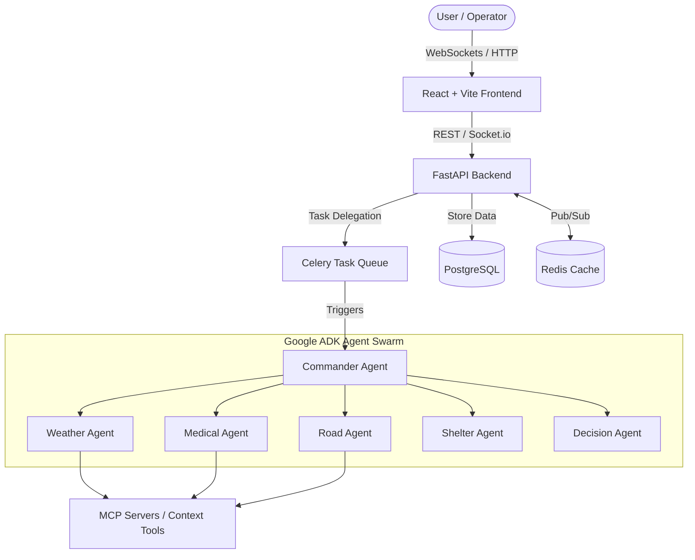

# 🌍 ResQNet – Multi-Agent Disaster Response Command Center

<div align="center">
  
  
  
  
  
  
</div>

<br />

> **ResQNet** is an advanced, fully functional AI-powered emergency response platform designed to coordinate rescue operations during disasters such as earthquakes, floods, hurricanes, wildfires, landslides, and tsunamis. Built for the **Kaggle Google Agents Hackathon**.

---

<details>
<summary><b>✨ View Architecture Diagram</b></summary>
<br/>


</details>

<details open>
<summary><b>🚀 Core Features</b></summary>
<br/>

- 🧠 **Google ADK Multi-Agent System:** 12 specialized agents (Commander, Weather, Medical, Logistics, Shelter, etc.) running autonomously to resolve crisis scenarios.
- ⚡ **FastAPI Backend:** Secure (JWT, RBAC), real-time (WebSockets), and asynchronous (Celery, Redis) architecture.
- 🎨 **React Frontend:** Modern, glassmorphism-inspired UI with interactive maps (Leaflet), real-time agent tracking, and a full simulation suite.
- 🔌 **MCP Servers:** Integrated tool servers providing context for weather, map routing, and database interactions.
- 🐳 **Docker Compose:** One-command deployment.
</details>

---

## 💻 Quick Start & Installation

<details>
<summary><b>View Installation Steps</b></summary>
<br/>

### Prerequisites
- [Docker](https://www.docker.com/) & Docker Compose
- Google Gemini API Key

### Steps

1. **Clone the repository**
   ```bash
   git clone <repo-url>
   cd ResQNet
   ```

2. **Configure Environment Variables**
   Create a `.env` file in the root directory:
   ```env
   GEMINI_API_KEY=your-gemini-api-key
   SECRET_KEY=your-secure-secret-key
   ```

3. **Start the Platform**
   ```bash
   docker-compose up --build
   ```

4. **Access the System**
   - 🖥️ **Frontend Dashboard**: `http://localhost:5173`
   - 📖 **Backend API Docs (Swagger)**: `http://localhost:8000/docs`
</details>

---

<details>
<summary><b>🤖 Agent Roster & Responsibilities</b></summary>
<br/>

| Agent Name | Role | Responsibility |
|---|---|---|
| **Commander Agent** | 🎯 Coordinator | Delegates tasks and resolves conflicts between other agents. |
| **Weather Agent** | 🌪️ Risk Predictor | Analyzes storm patterns and predicts flood/lightning danger. |
| **Medical Agent** | 🏥 Medical Officer | Tracks hospital beds, ICUs, and triage. |
| **Road Agent** | 🛣️ Logistics | Maps evacuation routes and avoids blocked roads. |
| **Shelter Agent** | ⛺ Evacuation | Finds and manages available shelters for displaced citizens. |
| **Decision Agent** | 🧠 Final Strategist | Synthesizes all reports into a priority ranking and timeline. |
</details>

<details>
<summary><b>🔒 Security Features</b></summary>
<br/>

- 🔐 **Authentication**: JWT Based Authentication protecting all endpoints.
- 👮‍♂️ **RBAC**: Strict role enforcement (`Admin`, `Operator`, `Citizen`).
- 🛡️ **Encryption**: Passwords hashed securely using `bcrypt`.
</details>

<details>
<summary><b>🧪 Testing</b></summary>
<br/>

Run unit tests directly inside the backend container to verify the API and agents:
```bash
docker exec -it resqnet-backend pytest
```
</details>

<details>
<summary><b>📄 License</b></summary>
<br/>

This project is licensed under the [MIT License](LICENSE).
</details>

---
<p align="center">Built with ❤️ for the Kaggle Google Agents Hackathon.</p>
